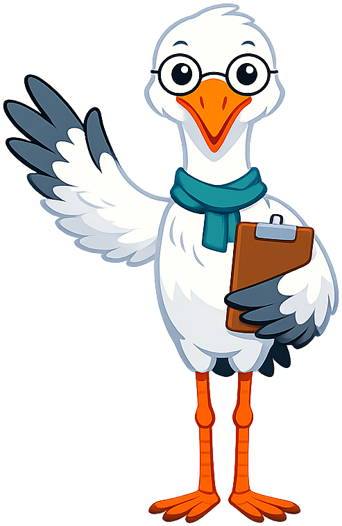
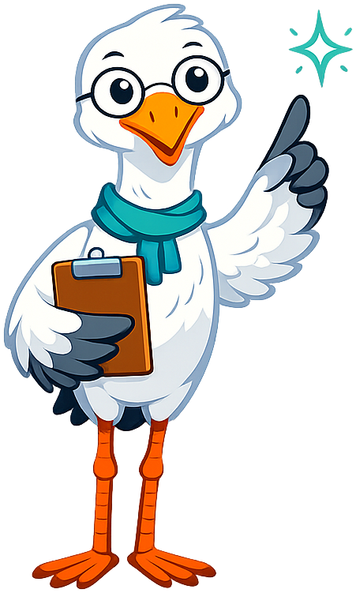
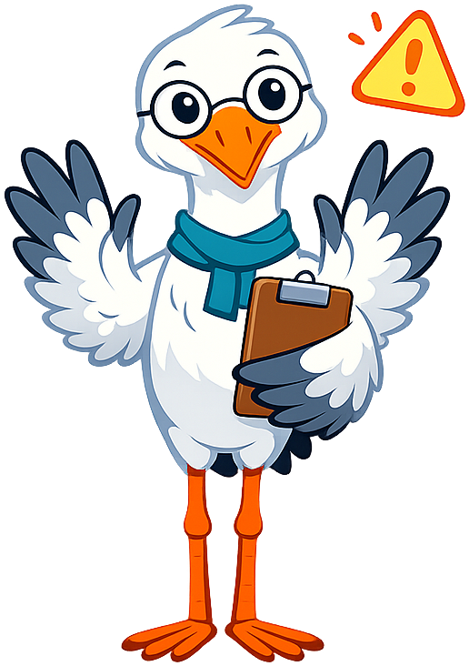

# Mascot Style Guide

This page shows every mascot admonition style for **Sage the Crane**,
the pedagogical mascot for *Introduction to Public Health*. Use it to
verify rendering after generating new pose images or editing
`docs/css/mascot.css`.

If a pose looks too small inside its admonition box, run the
padding-trim script on that image — AI generators almost always add
invisible transparent padding around the character. See
[`docs/img/mascot/image-prompts.md`](../img/mascot/image-prompts.md) for
the script invocation.

---

!!! mascot-neutral "A Note from Sage"
    
    This is the **neutral** style — used for general sidebars,
    introductions, or any content that doesn't call for a specific
    emotional tone.

!!! mascot-welcome "Welcome, Investigators!"
    
    This is the **welcome** style — used at the opening of every
    chapter. It signals "we're starting something new" and sets a warm,
    inviting tone.

!!! mascot-thinking "Key Insight"
    
    This is the **thinking** style — used to highlight key concepts,
    aha-moments, and ideas worth pausing on. Limit to two or three per
    chapter so each one carries weight.

!!! mascot-tip "Sage's Tip"
    
    This is the **tip** style — used for short, practical hints that
    help the reader do something better. Tips should be specific and
    actionable, not generic encouragement.

!!! mascot-warning "Common Mistake"
    
    This is the **warning** style — used for common mistakes and
    pitfalls. Frame the mistake first, then explain how to avoid it.
    Never use this style to scold the reader.

!!! mascot-encourage "You've Got This"
    
    This is the **encouraging** style — used where readers are likely
    to struggle. Acknowledge the difficulty, normalize the struggle,
    then point to the next concrete step.

!!! mascot-celebration "Great Progress!"
    
    This is the **celebration** style — used at the end of major
    sections or chapters to mark genuine progress. Reserve it for real
    milestones; if it fires after every paragraph, it stops meaning
    anything.

---

## Catchphrase Reference

Sage's signature lines, for use in admonition body text:

- "What does the evidence show?"
- "Let's look at the data together."
- "Who is being counted — and who isn't?"

See [`docs/img/mascot/character-sheet.md`](../img/mascot/character-sheet.md)
for the full character description and voice guidelines.
