# List of MicroSims

Interactive Micro Simulations to help students learn public health fundamentals.

-   **[CERC Five Stages Timeline](./cerc-stages-timeline/index.md)**

    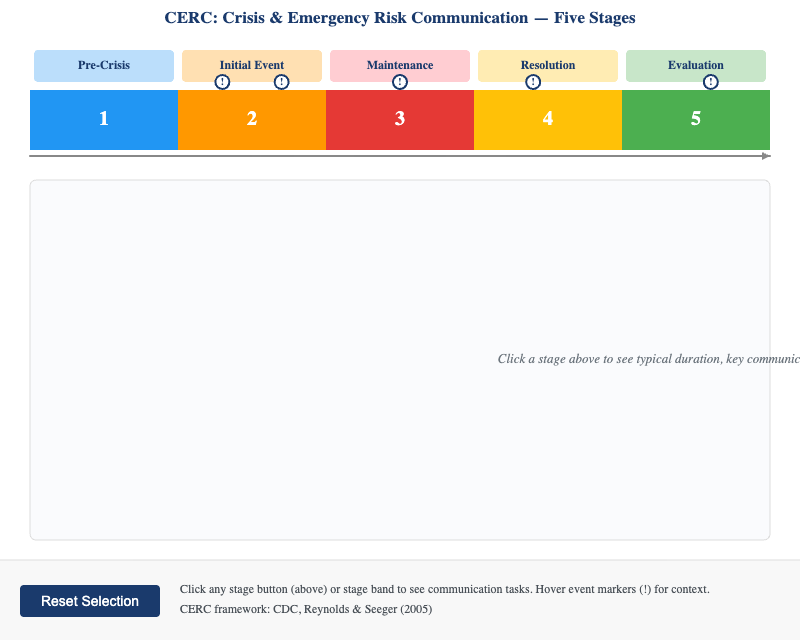

    Interactive horizontal timeline of the five CERC communication stages — Pre-Crisis, Initial Event, Maintenance, Resolution, and Evaluation — with COVID-19 examples and key communication tasks for each phase.

-   **[Confidence Interval Coverage from Repeated Sampling](./confidence-interval-coverage/index.md)**

    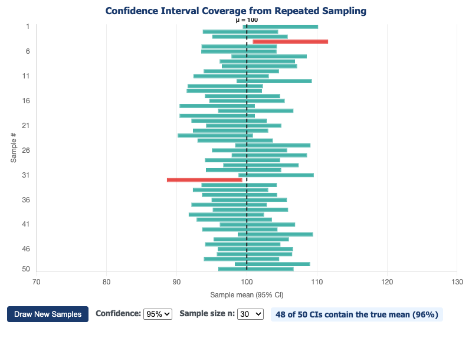

    Demonstrates what "95% confidence" really means by simulating repeated sampling and showing that approximately 5% of 95% CIs fail to capture the true population mean.

-   **[COVID-19 Excess Mortality by Demographic Group](./covid-excess-mortality/index.md)**

    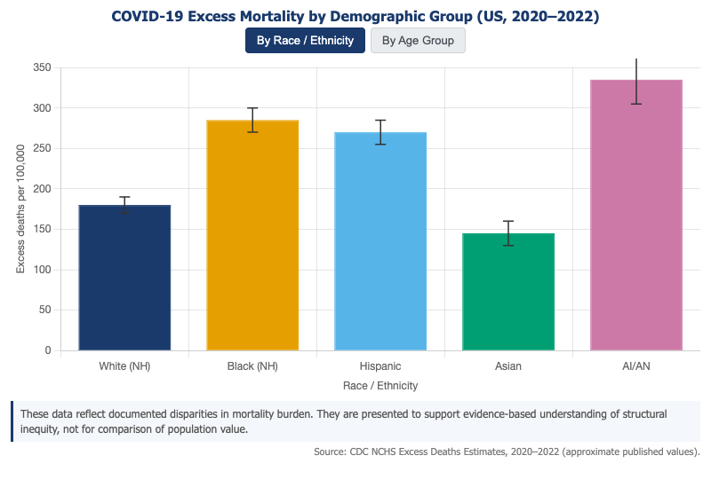

    Interactive grouped bar chart showing COVID-19 excess mortality rates per 100,000 by age group and race/ethnicity, revealing stark disparities across demographic groups during 2020–2022.

-   **[COVID-19 Key Events Timeline 2019–2023](./covid-timeline/index.md)**

    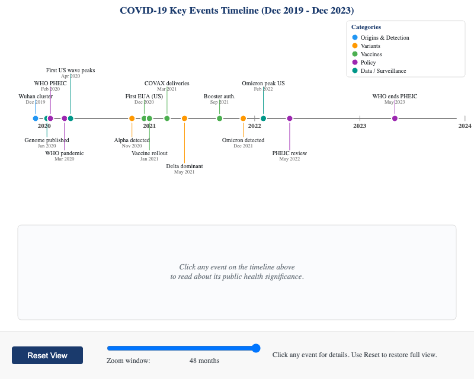

    Interactive timeline of key COVID-19 events from December 2019 to December 2023, with clickable nodes organized by category — variants, vaccines, policy, and surveillance.

-   **[COVID-19 Systems Causal Loop Map](./covid-systems-map/index.md)**

    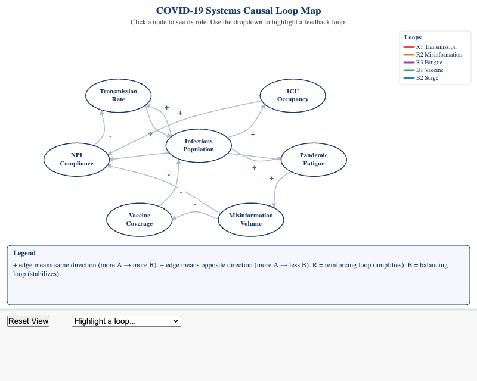

    Interactive causal loop diagram of COVID-19 system dynamics, with clickable nodes and color-coded feedback loops showing how transmission, misinformation, vaccination, and policy interact.

-   **[DAG Variable Structures Explorer](./dag-variable-structures/index.md)**

    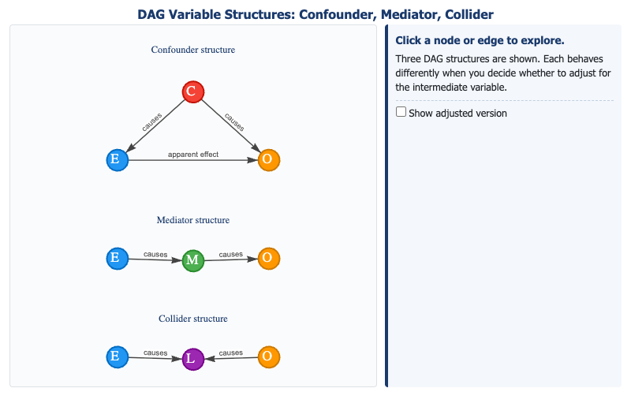

    Interactive explorer of the three DAG causal structures — confounder, mediator, and collider — showing how conditioning on each affects bias and causal inference.

-   **[Dahlgren-Whitehead Rainbow Model](./dahlgren-whitehead-rainbow/index.md)**

    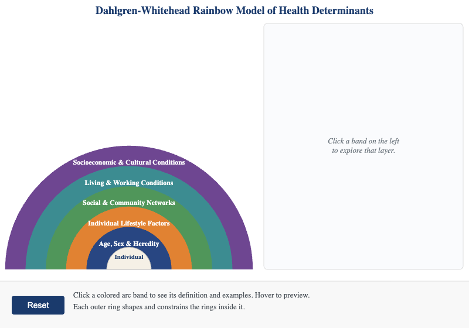

    Clickable concentric arc diagram of the Dahlgren-Whitehead social determinants model, with definitions and public health examples for each layer from individual biology to the socioeconomic environment.

-   **[Determinants of Health — Concentric Layers](./determinants-of-health-layers/index.md)**

    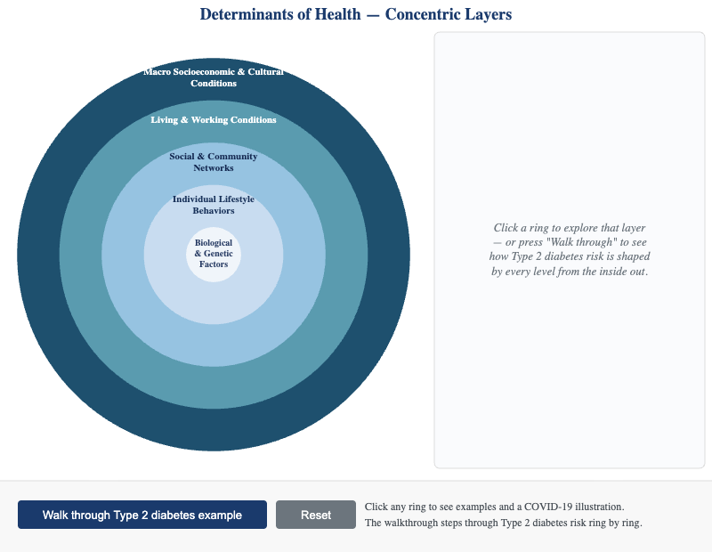

    Interactive concentric-layer diagram showing how outer-ring social and environmental determinants constrain and shape inner-ring individual choices and biological outcomes.

-   **[Eight Archetypes Reference Card](./system-archetypes/index.md)**

    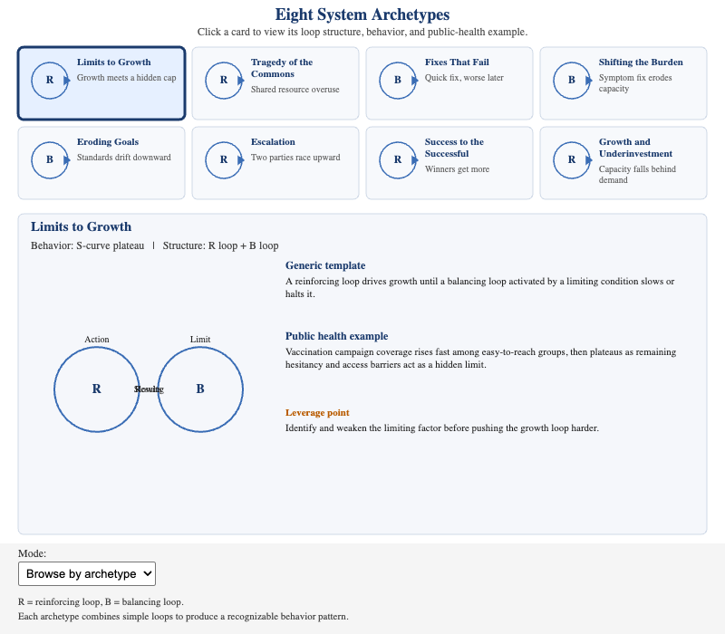

    Clickable 2×4 grid of the eight systems thinking archetypes, with loop diagrams, characteristic behavior-over-time patterns, and public health intervention examples for each.

-   **[Epidemic Curve Shape Explorer](./epidemic-curve-explorer/index.md)**

    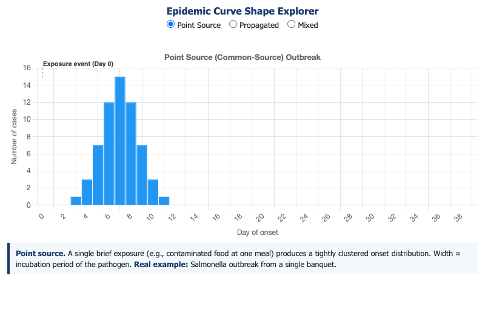

    Identify and interpret epidemic curve shapes to distinguish common-source point-exposure outbreaks from propagated person-to-person outbreaks.

-   **[EPIS Implementation Stages](./epis-stages/index.md)**

    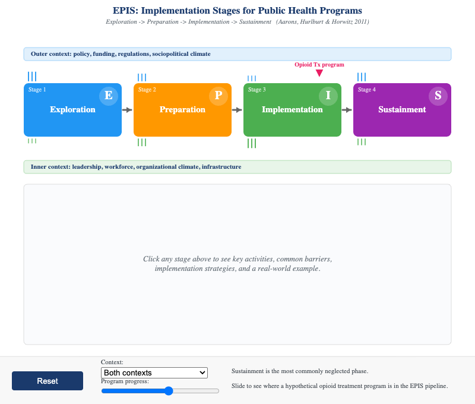

    Interactive workflow diagram of the four EPIS implementation stages — Exploration, Preparation, Implementation, and Sustainment — with real-world public health examples and common barriers at each phase.

-   **[Four-Step Risk Assessment Framework](./risk-assessment-framework/index.md)**

    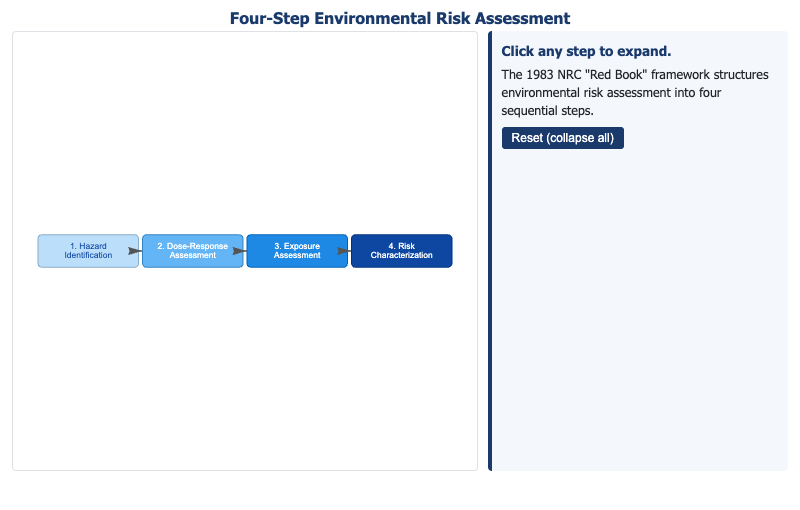

    Interactive directed graph of the EPA four-step risk assessment framework — Hazard Identification, Dose-Response, Exposure Assessment, and Risk Characterization — with example metrics for each step.

-   **[Haddon Matrix Builder](./haddon-matrix/index.md)**

    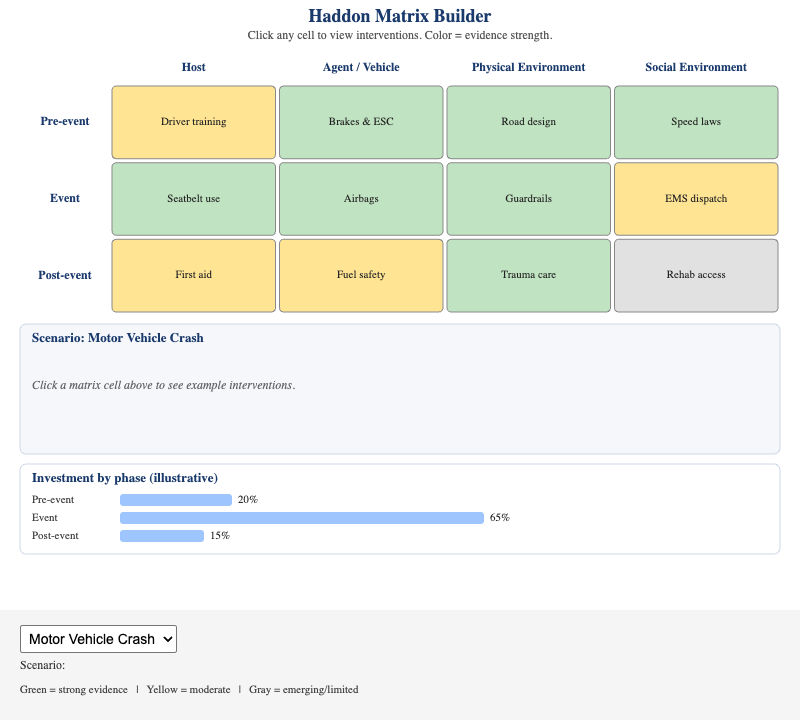

    Interactive 3×3 Haddon Matrix for injury scenarios — select from crash, drowning, fall, firearm, or overdose, and explore evidence-rated interventions for each phase-factor combination.

-   **[Health Belief Model — Interactive Concept Map](./health-belief-model/index.md)**

    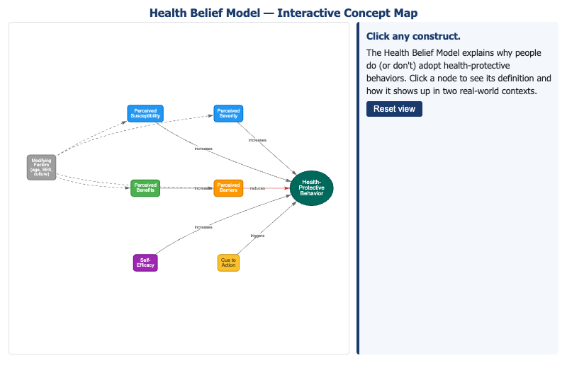

    Clickable network diagram of the Health Belief Model's six constructs, with definitions and COVID-19 vaccine examples showing how perceived susceptibility, barriers, and self-efficacy interact.

-   **[IOM Prevention Spectrum](./prevention-spectrum/index.md)**

    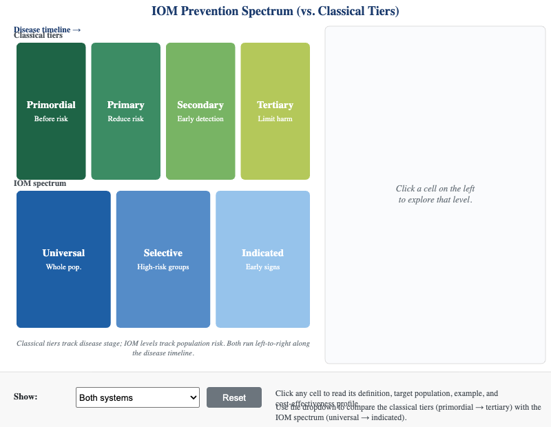

    Interactive nested diagram of the IOM prevention spectrum (universal, selective, indicated) embedded within the classical prevention tiers, with a toggle to compare the two classification systems.

-   **[Incidence vs. Prevalence Explorer](./incidence-prevalence-explorer/index.md)**

    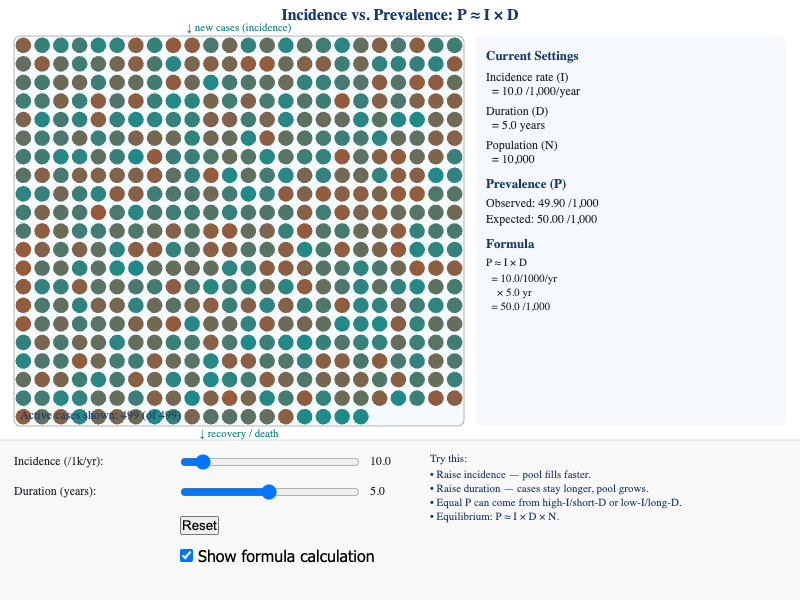

    Apply the relationship between incidence rate, disease duration, and prevalence proportion by adjusting simulation parameters and observing how the prevalence pool fills and drains.

-   **[Interactive Forest Plot](./forest-plot-interactive/index.md)**

    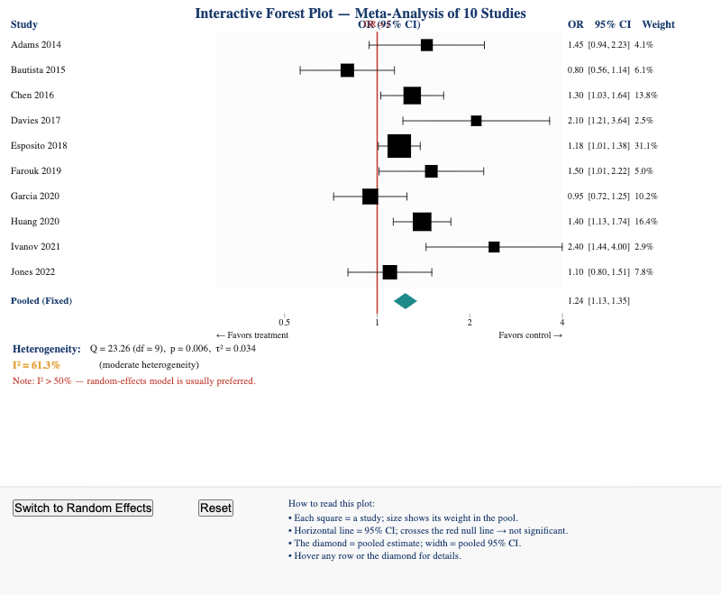

    Students can read a forest plot, identify each study's contribution, recognize the pooled estimate diamond, and interpret heterogeneity statistics.

-   **[Interrupted Time-Series Analysis Workflow](./its-analysis-workflow/index.md)**

    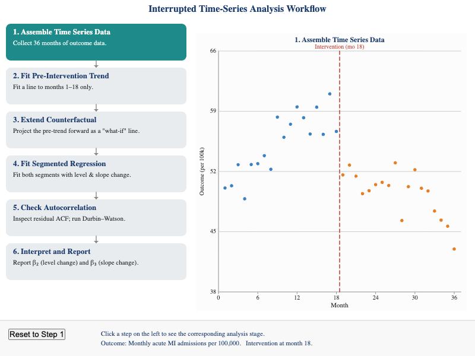

    Students can describe each step of an ITS analysis, identify the four regression coefficients, and recognize threats to validity such as co-interventions and autocorrelation.

-   **[Kaplan-Meier Survival Curve Explorer](./kaplan-meier-explorer/index.md)**

    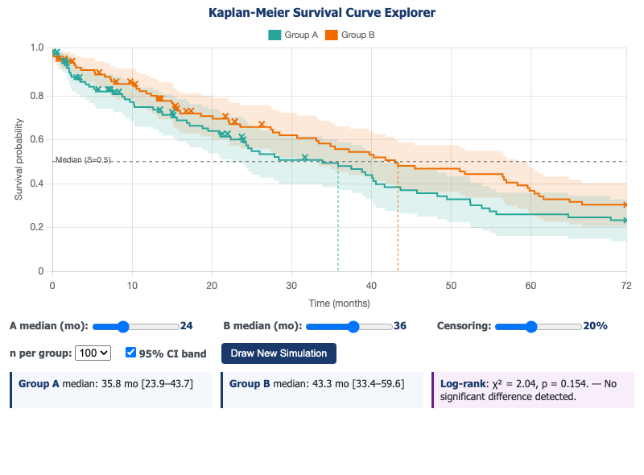

    Students can interpret a Kaplan-Meier survival curve, identify median survival for each group, recognize the effect of censoring, and interpret the log-rank test comparing two groups.

-   **[Key Milestones in Public Health History](./public-health-history-timeline/index.md)**

    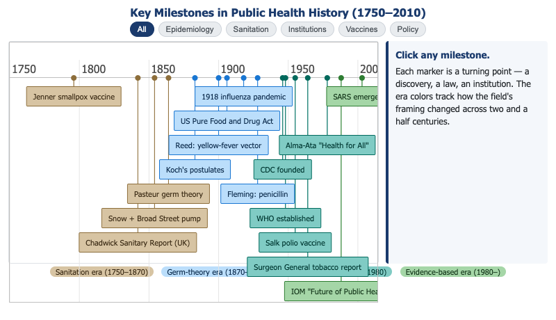

    Students can identify at least six pivotal events in public health history and explain what conceptual shift or institutional development each represented.

-   **[Kingdon's Three Streams Model](./kingdons-three-streams/index.md)**

    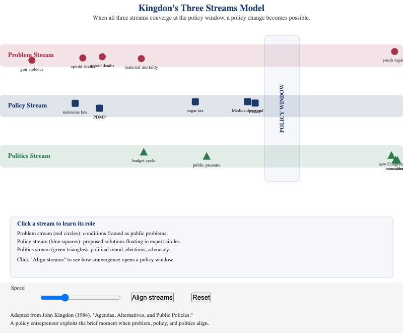

    Animated visualization of Kingdon's Problem, Policy, and Politics streams where students drag streams to align at a policy window, triggering a "policy change" event when all three converge.

-   **[Life Expectancy and Infant Mortality by Race and Income](./health-disparities-bar-chart/index.md)**

    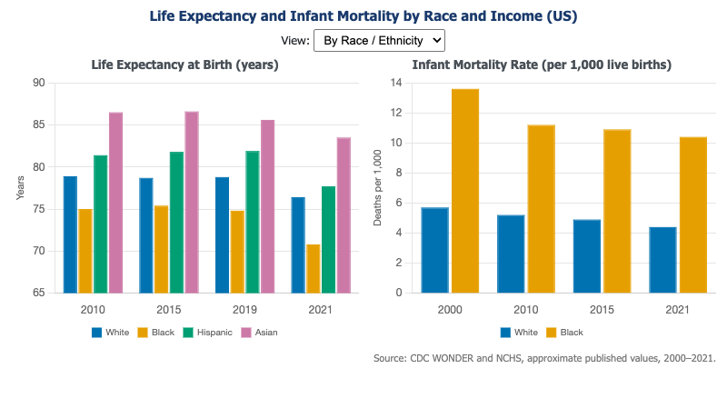

    Grouped bar charts showing racial and income disparities in life expectancy and infant mortality from 2000 to 2021, with a toggle to compare by race or income quartile.

-   **[Meadows Leverage Points Hierarchy](./meadows-leverage/index.md)**

    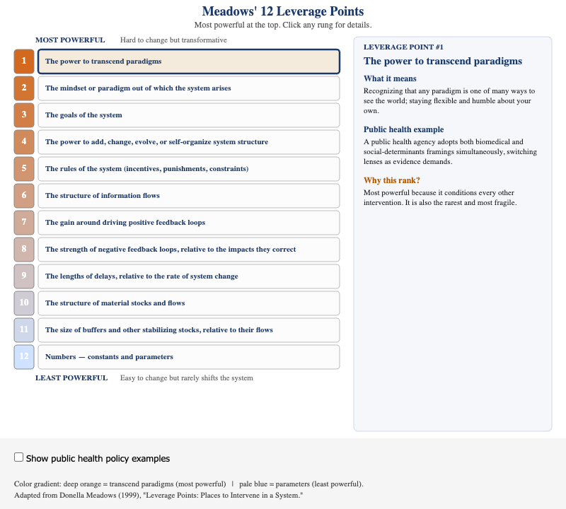

    Interactive ranked list of all 12 Meadows leverage points with public health policy examples, showing why changing goals and paradigms is more powerful than adjusting system parameters.

-   **[MicroSim Design Process](./microsim-design-process/index.md)**

    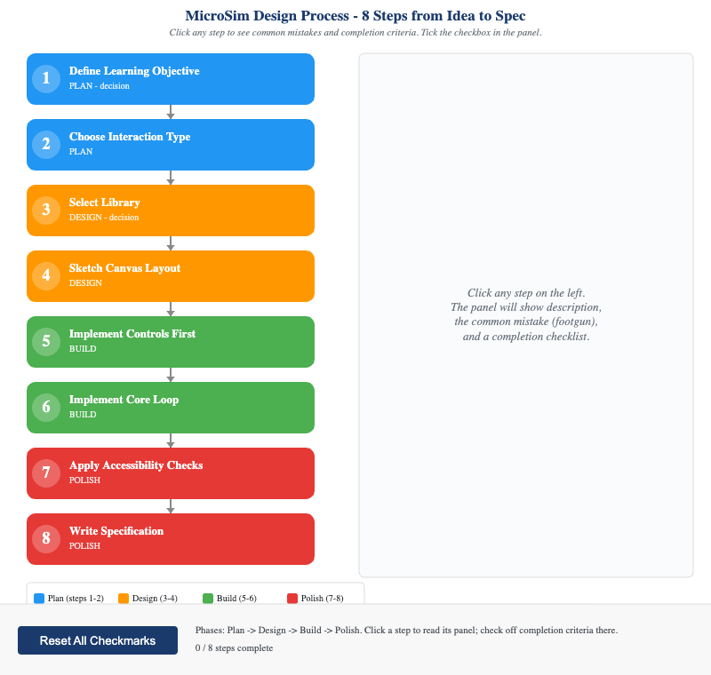

    Clickable flowchart of the eight-stage MicroSim design process — from defining a single learning objective through iterative testing and deployment, with gates that prevent scope creep.

-   **[Normal Distribution Explorer](./normal-distribution-explorer/index.md)**

    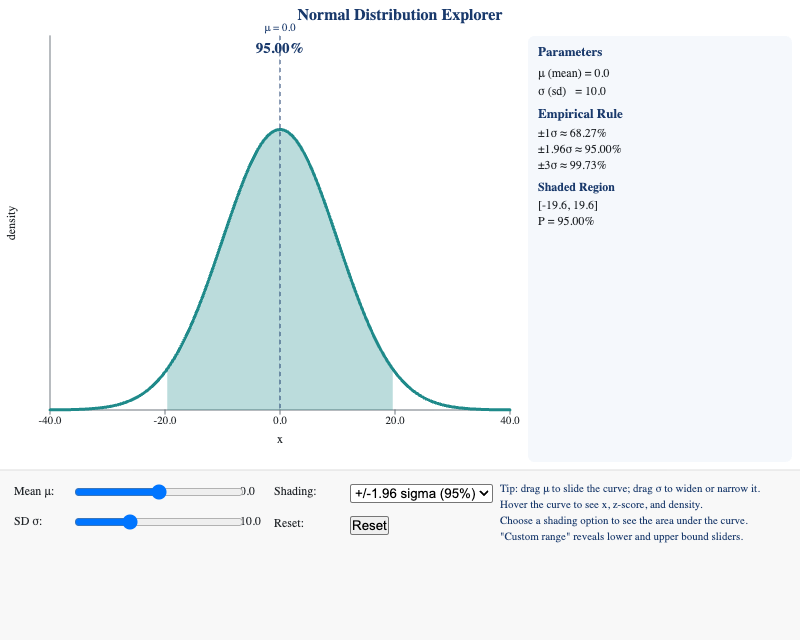

    Students can explain how changing the mean and standard deviation affects a normal distribution's shape and identify what fraction of values fall within 1, 2, and 3 standard deviations.

-   **[Nuffield Council Ladder of Interventions](./nuffield-ladder/index.md)**

    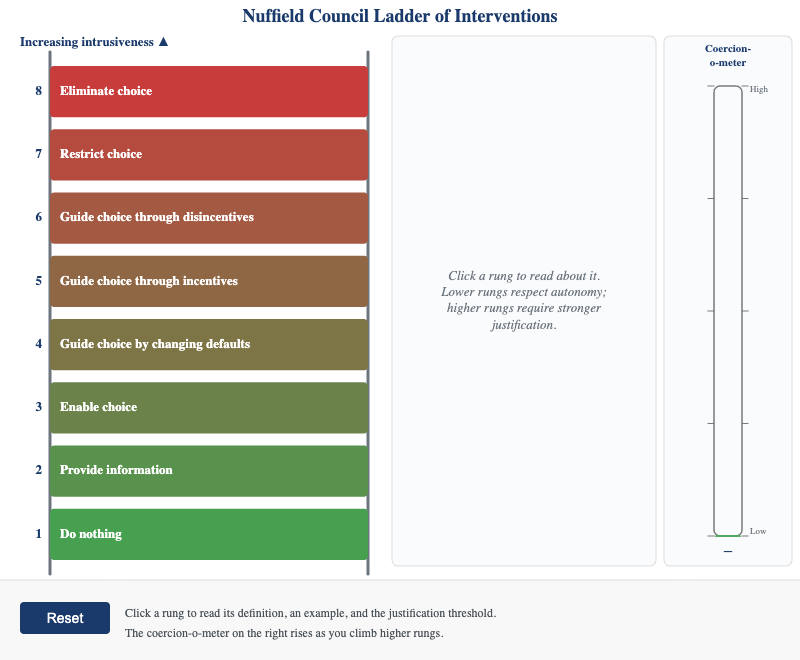

    Interactive 8-rung ladder from "Do Nothing" to "Eliminate Choice," with public health examples and a coercion-o-meter showing how each rung raises the justification threshold.

-   **[p5.js MicroSim Anatomy](./p5-microsim-anatomy/index.md)**

    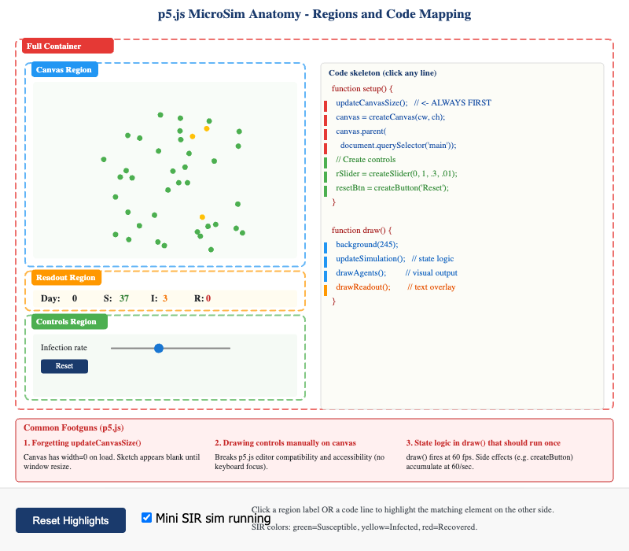

    Split-panel diagram annotating the regions of a running p5.js simulation alongside the corresponding code sections, helping students understand how interactive sims are structured.

-   **[Pharmaceutical vs. Supplement Pre-Market Requirements](./dshea-regulatory-gap/index.md)**

    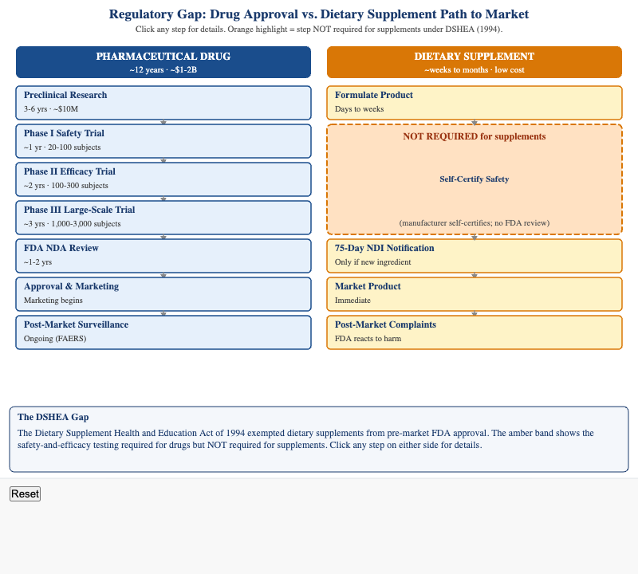

    Side-by-side comparison of pharmaceutical drug approval vs. dietary supplement market entry, highlighting the regulatory steps required for drugs that are absent for supplements under DSHEA.

-   **[Prevention Levels Mapped to Natural History of Disease](./prevention-natural-history/index.md)**

    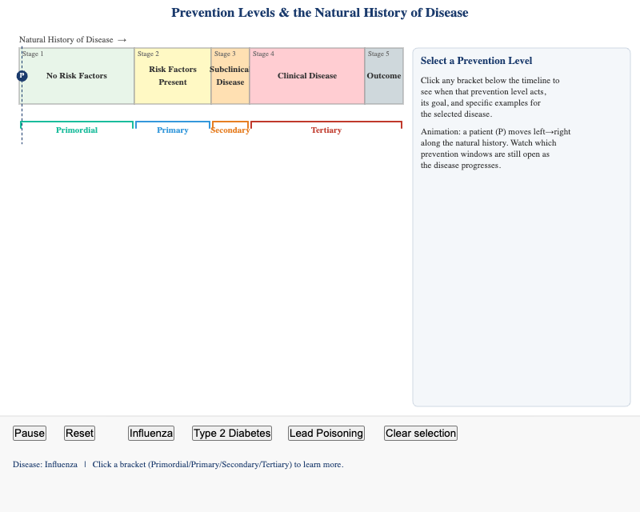

    Students can explain how the four prevention levels map onto the stages of natural history of disease and identify which prevention strategy is appropriate at each stage.

-   **[R₀ and Herd Immunity Explorer](./r0-herd-immunity-explorer/index.md)**

    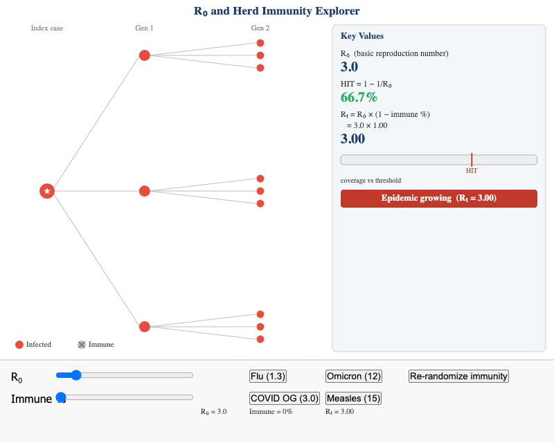

    Apply the relationship between R₀ and the herd immunity threshold by adjusting R₀ values for different pathogens and calculating the required vaccination coverage.

-   **[Record Linkage Process](./record-linkage-process/index.md)**

    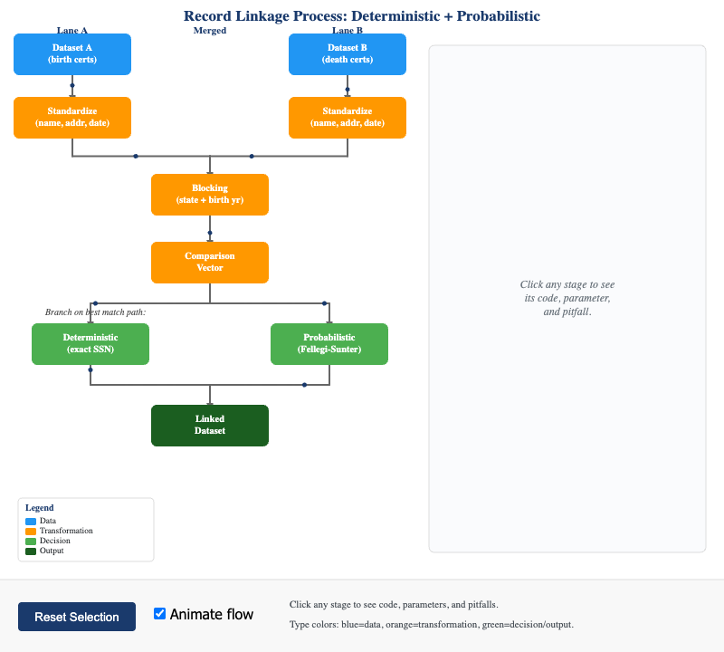

    Interactive flowchart of probabilistic record linkage between two datasets — from standardization and blocking through match scoring, human review, and the final linked file.

-   **[Reinforcing vs. Balancing Feedback Loops](./feedback-loops-compare/index.md)**

    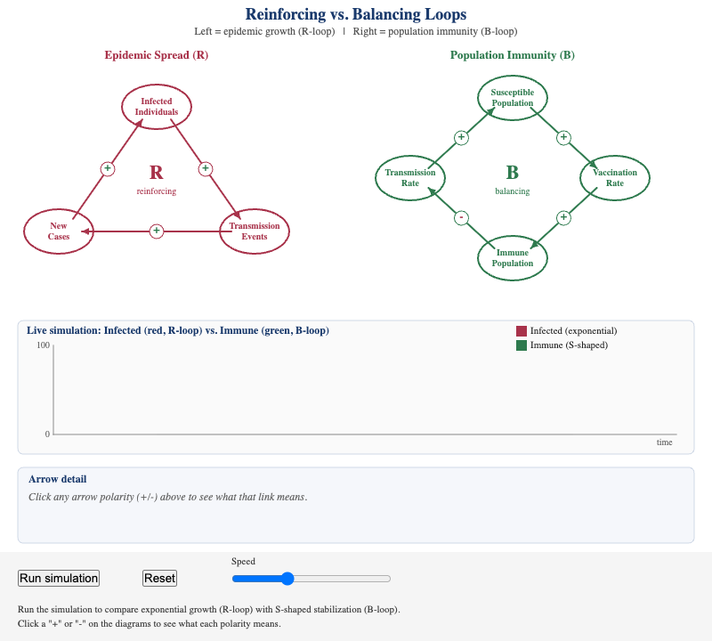

    Side-by-side animated comparison of a reinforcing feedback loop (epidemic growth) and a balancing feedback loop (population immunity), illustrating why epidemic curves flatten.

-   **[Reproducible Research Workflow](./reproducible-research-workflow/index.md)**

    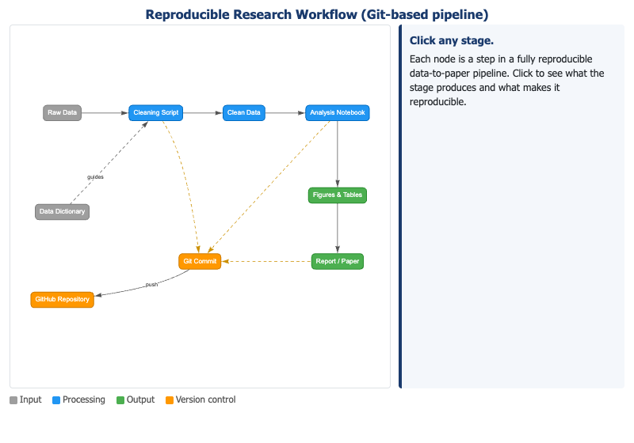

    Directed graph of a Git-based reproducible research pipeline from raw data and data dictionary through analysis scripts, version control, and publication-ready outputs.

-   **[SIFT Applied to a Supplement Claim](./sift-supplement/index.md)**

    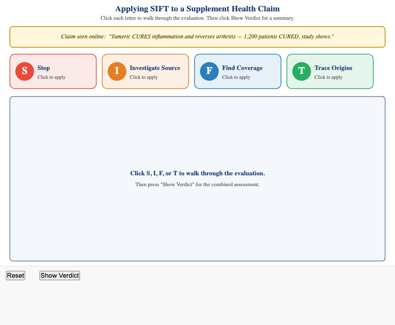

    Worked SIFT walkthrough of a supplement health claim — exposing red flags in source credibility, finding independent coverage, and tracing a misleading citation back to a company-sponsored abstract.

-   **[SIFT Method Decision Flowchart](./sift-flowchart/index.md)**

    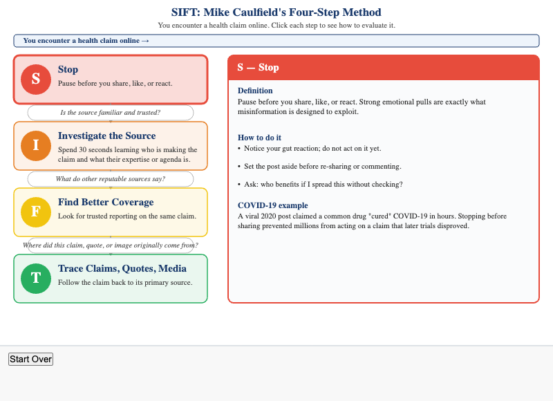

    Vertical clickable flowchart of the SIFT method (Stop, Investigate Source, Find Coverage, Trace Claims) with COVID-19 misinformation worked examples at each step.

-   **[Screening Test Performance Calculator](./screening-test-calculator/index.md)**

    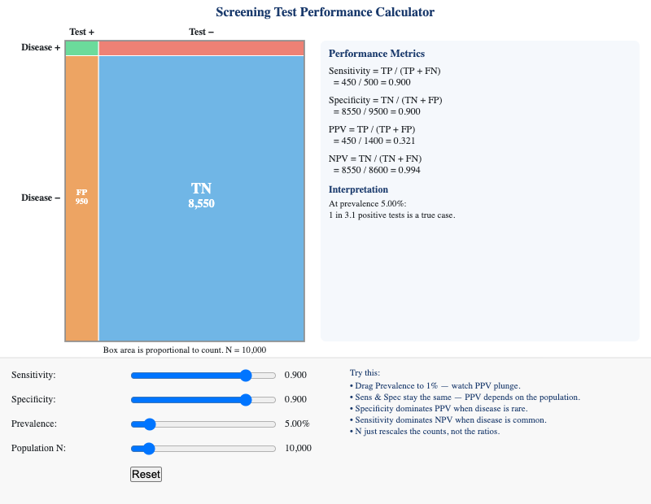

    Apply sensitivity, specificity, PPV, and NPV calculations by adjusting sliders and observing how each metric changes, especially as disease prevalence varies.

-   **[SIR Model Compartment Flow](./sir-compartments/index.md)**

    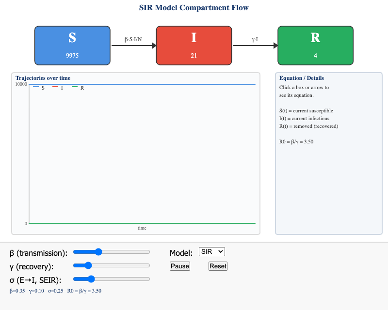

    Interactive SIR/SEIR compartment diagram with clickable arrows revealing rate equations and real-time stock updates as β and γ sliders are adjusted.

-   **[Social-Ecological Model — Interactive Concentric Levels](./social-ecological-model/index.md)**

    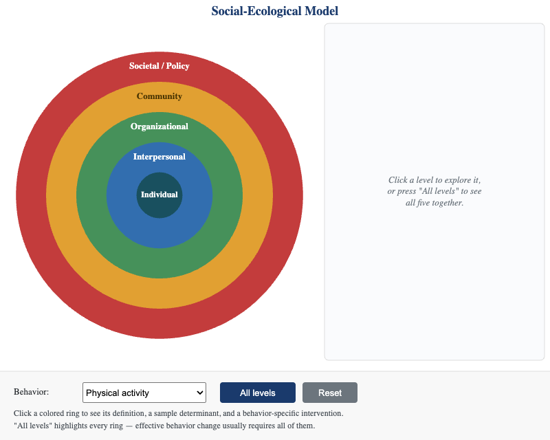

    Clickable concentric-circle diagram of the Social-Ecological Model's five levels, with behavior-specific intervention examples for physical activity, healthy eating, and safe sex.

-   **[Spatial Analysis Workflow](./spatial-analysis-workflow/index.md)**

    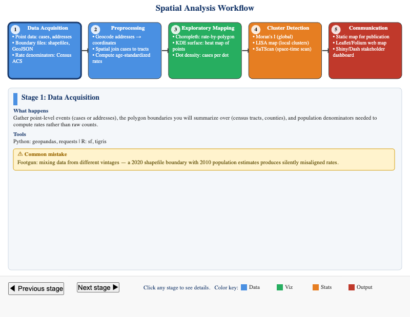

    Horizontal pipeline of the five spatial analysis stages — from data acquisition and preprocessing through clustering, visualization, and interpretation — with clickable stage descriptions.

-   **[Study Design Evidence Hierarchy](./study-design-hierarchy/index.md)**

    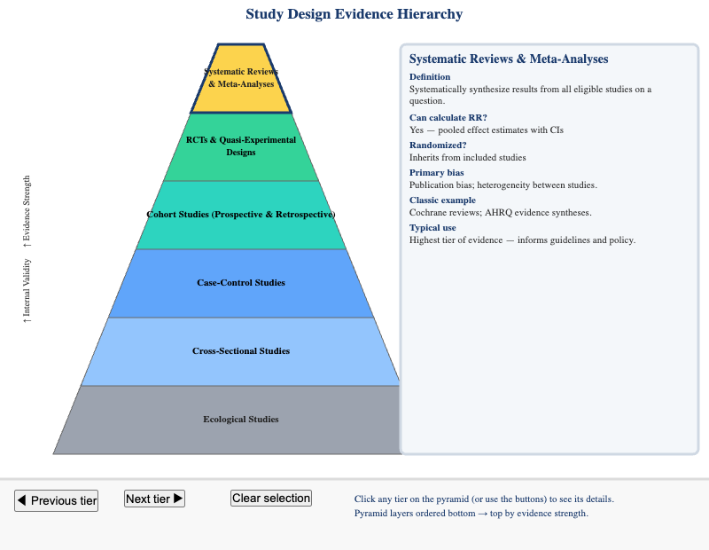

    Identify and compare epidemiological study designs by their position in the evidence hierarchy, their key strengths, and their primary limitations.

-   **[The 10 Essential Public Health Services](./essential-public-health-services/index.md)**

    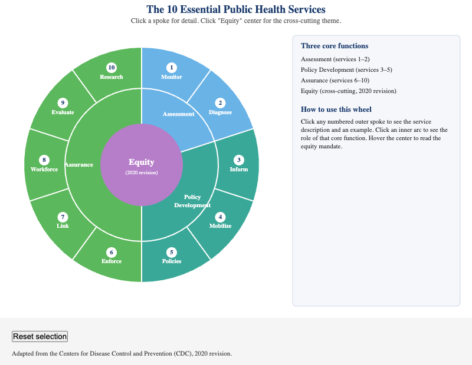

    Students can identify all 10 Essential Public Health Services, assign each to its correct core function, and explain the equity mandate added in the 2020 revision.

-   **[Type I/II Error and Power Visualizer](./hypothesis-error-power/index.md)**

    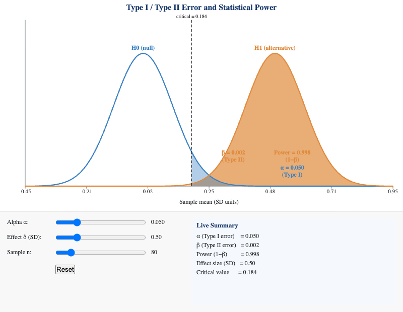

    Students can explain the trade-off between Type I and Type II errors and describe how changing alpha, effect size, and sample size affect statistical power.

-   **[Universal Health Coverage Cube](./uhc-coverage-cube/index.md)**

    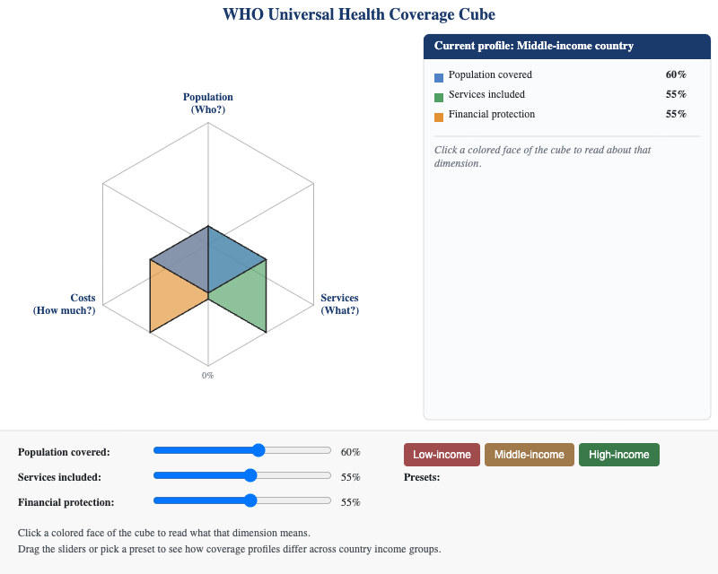

    3D interactive cube representing the WHO UHC model's three dimensions — population covered, services included, and financial protection — with country-profile presets to compare coverage gaps.

-   **[US Health System Structure](./us-health-system-structure/index.md)**

    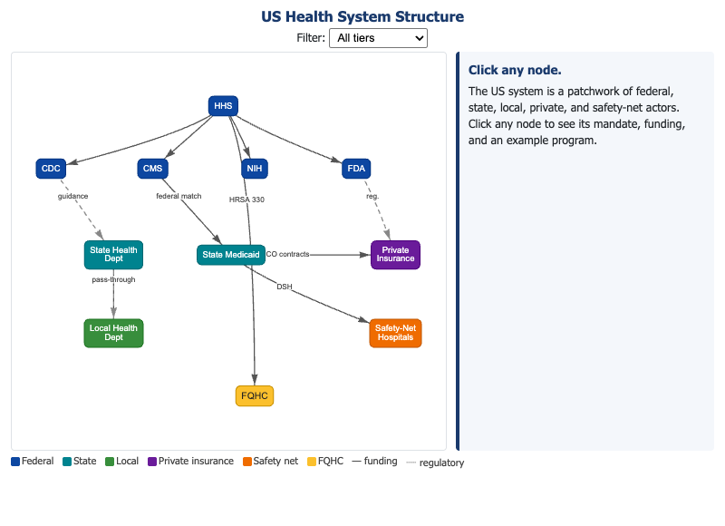

    Interactive layered network diagram of the US health system — federal agencies, state/local health departments, insurers, and safety-net providers — with funding flows and regulatory authority edges.

-   **[Wastewater Epidemiology Pipeline](./wastewater-epi-pipeline/index.md)**

    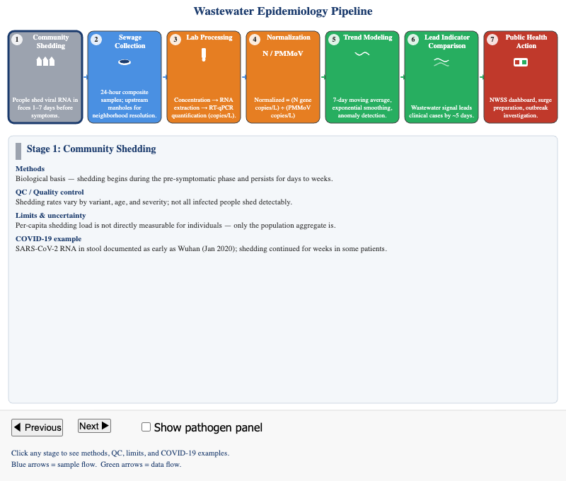

    Animated seven-stage pipeline from community shedding to disease trend reporting, showing how viral RNA in sewage is collected, processed, and translated into public health surveillance signals.

